# 🏫 CampusBooking Lite – Espacios y Reservas

CampusBooking Lite es un módulo interno desarrollado en Laravel para registrar espacios físicos (aulas, salas, laboratorios) y gestionar reservas básicas de dichos espacios. El sistema ofrece operaciones CRUD simples sobre dos entidades principales: Espacio y Reserva, con una relación uno a muchos (un espacio puede tener muchas reservas). Se implementaron migraciones, modelos, controladores tipo resource, vistas Blade y rutas web. La paginación está configurada para mostrar 10 elementos por página, y se incluyen mensajes flash para confirmar acciones como creación, edición o eliminación.

## 📋 Requisitos
PHP >= 8.1, Composer >= 2.x, Laravel >= 10.x, MySQL/MariaDB (o cualquier base de datos soportada por Laravel), extensiones de PHP: pdo, mbstring, tokenizer, xml, ctype, json, y opcionalmente Node.js/NPM si se desea compilar assets con Vite.

## ⚙️ Pasos de instalación
1. Clonar el repositorio: `git clone https://github.com/tuusuario/campusbooking-lite.git && cd campusbooking-lite`  
2. Instalar dependencias de PHP: `composer install`  
3. Configurar entorno: copiar `.env.example` a `.env` y editar las variables de conexión a la base de datos (DB_CONNECTION, DB_HOST, DB_PORT, DB_DATABASE, DB_USERNAME, DB_PASSWORD).  
4. Generar la clave de la aplicación: `php artisan key:generate`  
5. (Opcional) Instalar dependencias frontend: `npm install && npm run dev`

## 🗄️ Migraciones y base de datos
Ejecutar las migraciones para crear las tablas de espacios y reservas: `php artisan migrate`  
Si se desea reiniciar la base de datos desde cero: `php artisan migrate:fresh --seed`

## 🚀 Funcionalidades principales
CRUD de Espacios (nombre, tipo, capacidad, ubicación), CRUD de Reservas (solicitante, fecha, hora inicio/fin, motivo opcional), relación uno a muchos entre espacios y reservas, paginación configurada a 10 elementos por página, mensajes flash para confirmar acciones, vistas Blade simples (`index`, `create`, `edit`, `partials/form`).

## 🎥 Demostración

A continuación se muestran capturas de las operaciones CRUD de Espacios y Reservas:

### CRUD de Espacios

**Crear Espacios**  
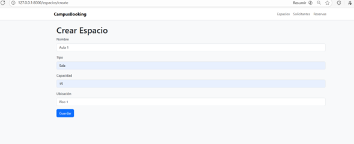

**Editar Espacios**  
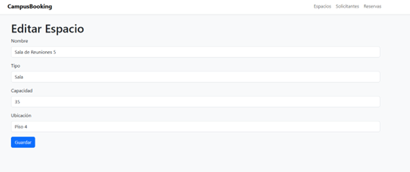

**Eliminar Espacios**  
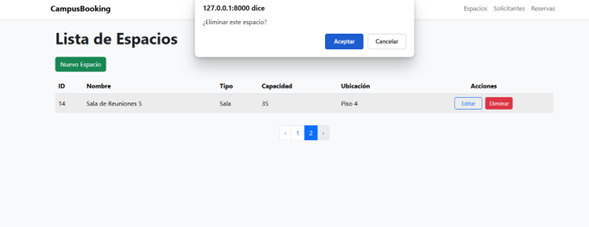

**Lista de Espacios**  
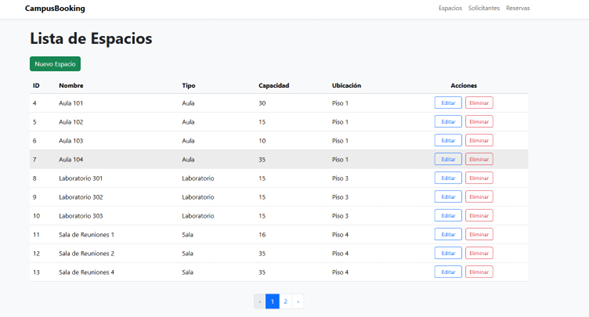

---

### CRUD de Reservas

**Crear Reservas**  
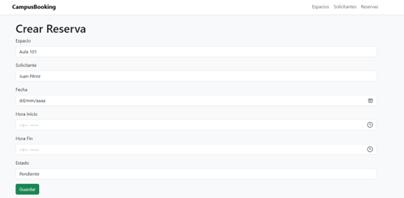

**Editar Reservas**  
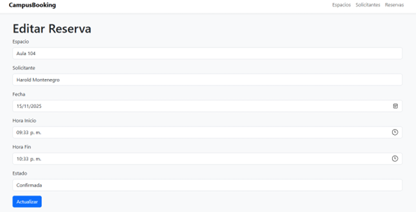

**Eliminar Reservas**  
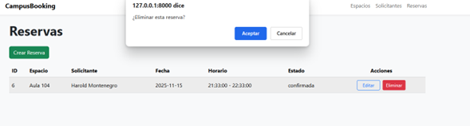

**Lista de Reservas**  
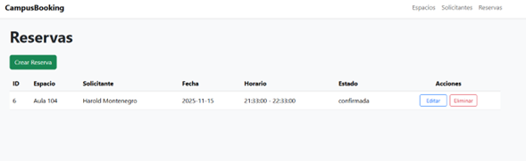

---

### CRUD de Solicitantes

**Crear Solicitantes**  
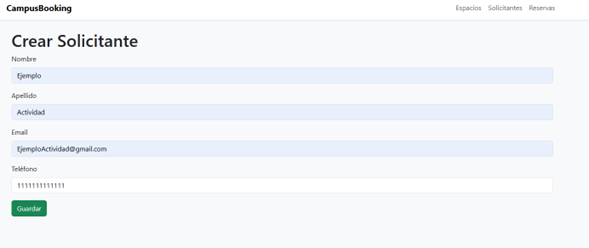

**Editar Solicitantes**  
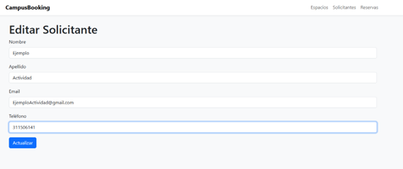

**Eliminar Solicitantes**  
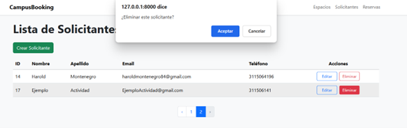

**Lista de Solicitantes**  
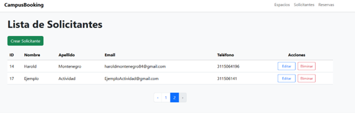
